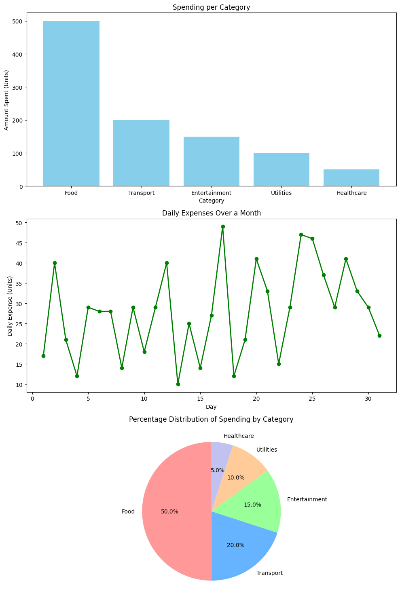

<<<<<<< HEAD
There are many great README templates available on GitHub; however, I didn't find one that really suited my needs so I created this enhanced one. I want to create a README template so amazing that it'll be the last one you ever need -- I think this is it.

Here's why:
* Your time should be focused on creating something amazing. A project that solves a problem and helps others
* You shouldn't be doing the same tasks over and over like creating a README from scratch
* You should implement DRY principles to the rest of your life :smile:

Of course, no one template will serve all projects since your needs may be different. So I'll be adding more in the near future. You may also suggest changes by forking this repo and creating a pull request or opening an issue. Thanks to all the people have contributed to expanding this template!


```
jfsdhgfds
piu install\
```


=======
"Personal Expense Tracker"

Objective:Python application for users to input their daily expenditure,types,and analyze their economic structure .

Load and manipulate the data using Pandas.

Add a New Expense and Update an Existing Expense

Ensure users select a valid predefined category (e.g., Food, Transport, Entertainment, Utilities, or Others) for each expense.

Use Matplotlib to create: 

a) bar chart(category) ,

b)line chart(per month expenses)

c)pie chart for percentage distribution of spending by category.
>>>>>>> 617940d827a3b5ccfc803de5d66a6adca865d990
